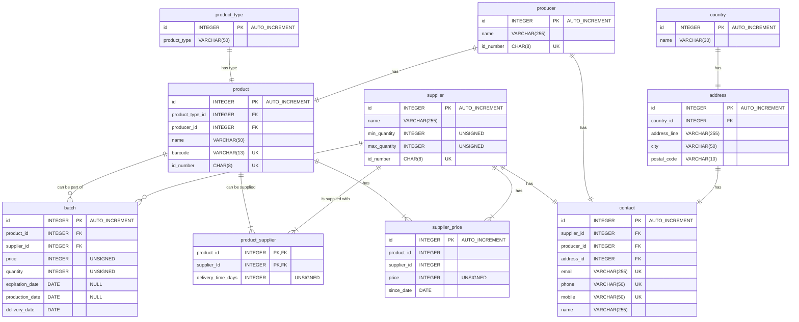

# Stock Availability Management System

Develop a server application for the management of stock availability of a retail chain.

Entity Relationship diagram:

```mermaid
erDiagram
    product_type ||--|| product : "has type"
    producer ||--|| product : has
    product ||--o{ batch : "can be part of"
    product ||--|{ product_supplier : "can be supplied"
    supplier ||--o{ batch : "has many"
    supplier ||--|{ product_supplier : "is supplied with"
    supplier ||--|| contact : has
    product ||--|{ supplier_price : has
    supplier ||--|{ supplier_price : has
    country ||--|| address : has
    producer ||--|| contact : has
    address ||--|| contact : has
    product_type {
        id INTEGER PK "AUTO_INCREMENT"
        product_type VARCHAR(50)
    }
    product {
        id INTEGER PK "AUTO_INCREMENT"
        product_type_id INTEGER FK
        producer_id INTEGER FK
        name VARCHAR(50)
        barcode VARCHAR(13) UK
        id_number CHAR(8) UK
    }
    supplier {
        id INTEGER PK "AUTO_INCREMENT"
        name VARCHAR(255)
        min_quantity INTEGER "UNSIGNED"
        max_quantity INTEGER "UNSIGNED"
        id_number CHAR(8) UK
    }
    product_supplier {
        product_id INTEGER PK, FK
        supplier_Id INTEGER PK, FK
        delivery_time_days INTEGER "UNSIGNED"
    }
    batch {
        id INTEGER PK "AUTO_INCREMENT"
        product_id INTEGER FK
        supplier_id INTEGER FK
        price INTEGER "UNSIGNED"
        quantity INTEGER "UNSIGNED"
        expiration_date DATE "NULL"
        production_date DATE "NULL"
        delivery_date DATE
    }
    producer {
        id INTEGER PK "AUTO_INCREMENT"
        name VARCHAR(255)
        id_number CHAR(8) UK
    }
    supplier_price {
        id INTEGER PK "AUTO_INCREMENT"
        product_id INTEGER
        supplier_id INTEGER
        price INTEGER "UNSIGNED"
        since_date DATE
    }
    contact {
        id INTEGER PK "AUTO_INCREMENT"
        supplier_id INTEGER FK
        producer_id INTEGER FK
        address_id INTEGER FK
        email VARCHAR(255) UK
        phone VARCHAR(50) UK
        mobile VARCHAR(50) UK
        name VARCHAR(255)
    }
    address {
        id INTEGER PK "AUTO_INCREMENT"
        country_id INTEGER FK
        address_line VARCHAR(255)
        city VARCHAR(50)
        postal_code VARCHAR(10)
    }
    country {
        id INTEGER PK "AUTO_INCREMENT"
        name VARCHAR(30)
    }
```